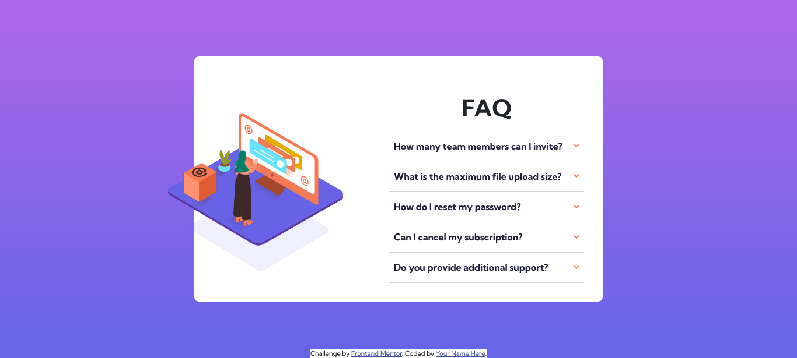

# Frontend Mentor - FAQ accordion card solution (bootstrap)

This is a solution to the [FAQ accordion card challenge on Frontend Mentor](https://www.frontendmentor.io/challenges/faq-accordion-card-XlyjD0Oam). Frontend Mentor challenges help you improve your coding skills by building realistic projects. 

### The challenge

Users should be able to:

- View the optimal layout for the component depending on their device's screen size
- See hover states for all interactive elements on the page
- Hide/Show the answer to a question when the question is clicked

### Screenshot

### Links

- Solution URL: [Add solution URL here](https://www.frontendmentor.io/solutions/faq-accordion-card-bootstrap-QoppWhSyJR)
- Live Site URL: [Add live site URL here](https://pooria98.github.io/FAQ-Accordion-Card--bootstrap-/)

### Built with

- HTML 5
- Bootstrap
- CSS custom properties